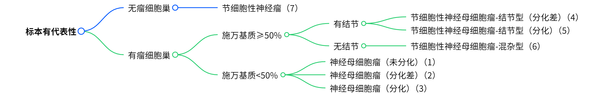

# MMNeuroB - 多模态神经母细胞瘤分类系统

一个基于深度学习的多尺度组织病理学图像分析框架，专门用于神经母细胞瘤及其亚型的自动分类诊断。

## 0. 程序运行前准备

下载示例数据svs 以及模型权重，放置到对应文件夹。
下载链接 [google drive]

## 1. 程序运行逻辑

### 1.1 整体工作流程

系统采用端到端的数据处理和分析流程，主要包含以下几个阶段：

```
KFB格式文件 → SVS格式转换 → 组织分割与切片 → 特征提取 → 特征融合 → 分类预测 → 结果评估
```

#### 阶段详解：

1. **（可选）格式转换 (00_kfb2tif2svs.py)**
   - 将KFB格式的病理切片文件转换为标准的SVS格式
   - 使用外部转换工具 `KFbioConverter.exe`
   - 工具及使用说明：[Google Drive](https://drive.google.com/file/d/1qYUPwCM3gfaC3StuFIVo9h5GwQZq8nCe/view)

2. **图像预处理 (01_preprocess.py)**
   - 自动组织区域分割和背景去除
   - 基于HSV颜色空间的组织检测算法
   - 生成多尺度的图像切片 (tiles)
   - 质量控制和可视化

3. **特征提取 (02_extract_moco_feature.py)**
   - 使用经过神母数据训练的Moco模型（使用CONCH模型初始化）
   - 批量提取图像切片的深度特征
   - 支持多尺度特征提取 (360μm, 720μm, 1440μm)

4. **特征融合 (03_concat_tiles_feature.py)**
   - 将同一WSI的所有切片特征按空间顺序连接
   - 生成WSI级别的特征表示

5. **模型测试与评估 (04_test.py)**
   - 加载训练好的多尺度分类模型
   - 对测试集进行预测
   - 生成详细的性能评估报告

6. **层次化精度分析 (05_count_acc_hiera.py)**
   - 基于神经母细胞瘤病理分类的层次特征进行精度分析
   - 支持细胞巢 (CN)、间质丰度 (SS)、结节特征 (N) 的层次化评估


### 1.2 分类体系
神经母细胞瘤亚型的层级分类逻辑：


测试样例中的类标需要按照上图组织。详情参见`samples/Annotations/test.json`
```
[
  {
        "patient_id": "01909891-4",
        "histological_type": "3",
        "MKI": "<2%",
        "description": "神经母细胞瘤（分化）"
    }
]
```


本模型将传统的7类神经母细胞瘤分类映射为4类(不考虑分化情况)：
- **Neuroblastoma** (神经母细胞瘤)
- **Ganglioneuroblastoma, nodular type** (结节型节细胞性神经母细胞瘤)
- **Ganglioneuroblastoma, mixed type** (混合型节细胞性神经母细胞瘤)
- **Ganglioneuroma** (节细胞性神经瘤)


## 2. 代码结构

### 2.1 项目目录结构

```
MMNeuroB/
├── 00_kfb2tif2svs.py              # KFB到SVS格式转换
├── 01_preprocess.py               # 图像预处理和切片生成
├── 01_preprocess_batch.sh         # 批量预处理脚本
├── 02_extract_moco_feature.py     # 基于MoCo模型的特征提取
├── 02_extract_moco_feature_batch.sh # 批量特征提取脚本
├── 03_concat_tiles_feature.py     # 切片特征拼接
├── 03_concat_tiles_feature.sh     # 批量特征拼接脚本
├── 04_test.py                     # 模型测试和评估
├── 04_test.sh                     # 批量测试脚本
├── 05_count_acc_hiera.py          # 层次化精度分析
├── NeuroBClassification/          # 核心分类模块
│   ├── datasets/                  # 数据集处理模块
│   ├── utils/                     # 工具函数
│   ├── model_multi.py            # 多尺度分类模型
│   ├── hiera_path_loss.py        # 层次化损失函数
│   └── metrics.py                # 评估指标计算
├── open_clip_custom/             # 自定义CLIP模型模块
├── samples/                      # 样本数据目录
│   ├── 00_kfb/                   # 原始KFB文件
│   ├── 01_svs/                   # 转换后的SVS文件
│   ├── 02_tiles/                 # 生成的图像切片
│   ├── 03_tile_features/         # 切片特征文件
│   ├── 04_wsi_features/          # WSI级别特征
│   └── Annotations/              # 标注和元数据
└── results/                      # 实验结果和日志
```

### 2.2 核心模块详解

#### 2.2.1 NeuroBClassification模块

**WSLTilesDataset类** (`datasets/child_path_4cls_multi_level.py`)
- 负责多尺度WSI数据的加载和预处理
- 支持主任务(病理分类)和辅助任务(MKI指数)
- 实现7类到4类的标签映射和特征转换

**EfficientModel类** (`model_multi.py`)
- 实现多尺度视觉-语言聚合模型
- 使用残差交叉注意力机制融合不同尺度特征
- 支持注意力池化和特征聚合

**HierarchicalLoss类** (`hiera_path_loss.py`)
- 支持标签平滑的交叉熵损失
- 同时处理主任务和辅助任务的损失计算

### 2.3 数据流和接口设计

#### 2.3.1 数据流向

```python
# 输入数据格式
{
    'multi_scale_features': {
        '360': {'features': tensor(B, N1, D)},
        '720': {'features': tensor(B, N2, D)},
        '1440': {'features': tensor(B, N3, D)}
    },
    'text_features': {
        'candidate': tensor(4, D),  # 4个类别的文本特征
        'mki': tensor(3, D)         # 3个MKI级别的特征(可选)
    },
    'labels': {
        'candidate': tensor(B),     # 主任务标签
        'mki': tensor(B)           # 辅助任务标签(可选)
    }
}
```

#### 2.3.2 模型输出

```python
# 模型预测输出
{
    'loss': tensor,              # 总损失
    'predictions': tensor(B, 4), # 4类分类概率
    'mki_predictions': tensor(B, 3), # MKI预测概率(可选)
    'attention_weights': tensor  # 注意力权重
}
```


## 3. 使用方法

### 3.1 环境要求

- Python 3.8+
- PyTorch 1.9+
- OpenSlide
- H5py
- scikit-learn
- torchmetrics

### 3.2 完整流程运行

1. **格式转换**：
   ```bash
   python 00_kfb2tif2svs.py
   ```

2. **图像预处理**：
   ```bash
   python 01_preprocess.py --input_slide path/to/slide.svs --output_dir ./samples/02_tiles --tile_size 360
   ```

3. **特征提取**：
   ```bash
   python 02_extract_moco_feature.py --image_root ./samples/02_tiles --features_root ./samples/03_tile_features --moco_checkpoint path/to/moco.pth --conch_checkpoint path/to/conch.bin
   ```

4. **特征融合**：
   ```bash
   python 03_concat_tiles_feature.py --features_root ./samples/03_tile_features --order_root ./samples/02_tiles --output_root ./samples/04_wsi_features
   ```

5. **模型评估**：
   ```bash
   python 04_test.py --anno_path ./samples/Annotations --feature_path ./samples/04_wsi_features --checkpoint_path path/to/model.pth --output_dir ./results
   ```

### 3.3 批量处理

系统提供了Shell脚本支持批量处理：
- `01_preprocess_batch.sh` - 批量预处理
- `02_extract_moco_feature_batch.sh` - 批量特征提取
- `03_concat_tiles_feature.sh` - 批量特征融合
- `04_test.sh` - 批量模型测试
